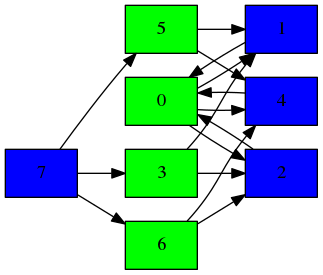

[](https://travis-ci.org/andsild/HaskellPageRank)  

# PageRank evaluation
Different ways to evaluate PageRank and graphcoloring in Haskell. I also have a PageRank with preprocessing which executes PageRank using a graphcoloring ordering scheme. 

# Setup
```bash
# make sure you have cloned sub-repositories
git clone --recursive
# or, if you already cloned:
git submodule update --init --recursive
```

## Build
```bash
stack build
# If you want to:
stack test
```

I personally use nix: ./shell.nix should take care of all dependencies and can be used with `nix-shell`

## Scripts
 * **./getData.sh** downloads some nice graphs from [Stanford's SNAP](http://snap.stanford.edu/index.html) framework (which is nice of Leskovec to put out).   
 * **./makeImage.sh** converts dotfiles to (more) human-viewable image files.
 * **./parseToLatex.sh** converts output from benchmarks to a format which is more easily read by latex. See header of *./benchmarkparser/Main.hs*. Most notably it groups results by graphname instead of method used.

## Folders
* **executables**: Main and benchmarks
* **benchmarkparser**: takes output from benchmark (**dist/benchmark.csv**) and groups it by graphname instead of method name. Useful for making latex figures.
* **internalutil**: stuff that needs to be shared across other folders/projects. Right now its just a placeholder for the graph representation.

The other folders hold general implementation-level code.


# Usage
## Measure energy usage
Probably the coolest feature of this repository.
It depends on [green-haskell's fork](https://github.com/green-haskell/criterion) of [criterion](https://github.com/bos/criterion). By default, results are written to *dist/benchmark.csv*.  
You get energy usage results by running (e.g.) `stack bench --benchmark-arguments "--regress energy:iters -m prefix small/doubleSquareEA"`. Some systems might require you to run this as root. In that case, prefix the previous command with `sudo` and add `--allow-different-user` as an argument.

## Evaluating single methods:
```bash
stack --nix build && stack  exec -- executables --file executables/input/500nodes4color.txt --method coloringGreedy
stack --nix build && stack  exec -- executables --file executables/input/500nodes4color.txt --method pagerankIO
# Visualize coloring. Example below
stack --nix build && stack  exec -- executables --file executables/input/500nodes4color.txt --method visualize && ./makeImage.sh # && xdg-open dist/graph.png
# ...etc. See executables/Main.hs for more options
```

### Example coloring


### Misc
A lot of this source code is written in a rush and by myself, so there is little adherence to conventional standards (outside of GHC's -Wall). If you want to use this project, you can ask me questions regarding code and I can try to clarify.

The source code right now has some commented out parts from the [lvars](https://github.com/iu-parfunc/lvars) dependency. This was a really cool project I want to make more use of, but haven't found the time yet to implement properly.
